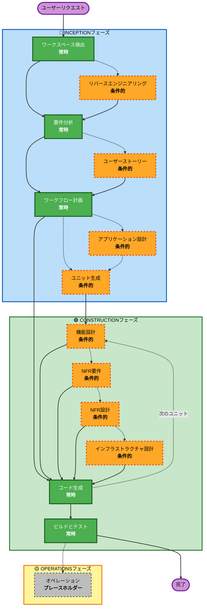

# AI-DLC 適応型ワークフロー概要

**目的**: AIモデルと開発者が完全なワークフロー構造を理解するための技術的な参考資料。

**注意**: 同様の内容が core-workflow.md (ユーザー向けウェルカムメッセージ) と README.md (ドキュメンテーション) にも存在します。この重複は意図的なものです - 各ファイルは異なる目的を果たします：
- **このファイル**: AIモデルのコンテキスト読み込み用のMermaid図を含む詳細な技術参考資料
- **core-workflow.md**: ASCII図を含むユーザー向けウェルカムメッセージ
- **README.md**: リポジトリのための人間が読めるドキュメンテーション

## 3フェーズのライフサイクル:
• **INCEPTIONフェーズ**: 計画とアーキテクチャ (ワークスペース検出 + 条件付きフェーズ + ワークフロー計画)
• **CONSTRUCTIONフェーズ**: 設計、実装、ビルド、テスト (ユニットごと設計 + コード計画/生成 + ビルド＆テスト)
• **OPERATIONSフェーズ**: 将来のデプロイと監視ワークフローのためのプレースホルダー

## 適応型ワークフロー:
• **ワークスペース検出** (常時) → **リバースエンジニアリング** (ブラウンフィールドのみ) → **要件分析** (常時、適応的な深さ) → **条件付きフェーズ** (必要に応じて) → **ワークフロー計画** (常時) → **コード生成** (常時、ユニットごと) → **ビルドとテスト** (常時)

## 仕組み:
• **AIが**あなたのリクエスト、ワークスペース、複雑さを分析し、どのステージが必要かを判断します
• **これらのステージは常に実行されます**: ワークスペース検出、要件分析 (適応的な深さ)、ワークフロー計画、コード生成 (ユニットごと)、ビルドとテスト
• **他のすべてのステージは条件的です**: リバースエンジニアリング、ユーザーストーリー、アプリケーション設計、ユニット生成、ユニットごと設計ステージ (機能設計、NFR要件、NFR設計、インフラストラクチャ設計)
• **固定シーケンスなし**: ステージはあなたの特定のタスクにとって意味のある順序で実行されます

## あなたのチームの役割:
• 専用の質問ファイルで、文字の選択肢 (A, B, C, D, E) を使って `[Answer]:` タグで質問に答えます
• **選択肢Eが利用可能**: 提供された選択肢が合わない場合、「その他」を選び、カスタムの回答を記述します
• **チームとして協力し**、進行する前に各フェーズをレビューし、承認します
• 必要に応じてアーキテクチャアプローチについて**集合的に決定します**
• **重要**: これはチームの努力です - 各フェーズに関連するステークホルダーを関与させてください

## AI-DLC 3フェーズワークフロー:



**ステージの説明:**

**🔵 INCEPTIONフェーズ** - 計画とアーキテクチャ
- ワークスペース検出: ワークスペースの状態とプロジェクトタイプを分析 (常時)
- リバースエンジニアリング: 既存のコードベースを分析 (条件的 - ブラウンフィールドのみ)
- 要件分析: 要件を収集し検証 (常時 - 適応的な深さ)
- ユーザーストーリー: ユーザーストーリーとペルソナを作成 (条件的)
- ワークフロー計画: 実行計画を作成 (常時)
- アプリケーション設計: 高レベルのコンポーネント特定とサービスレイヤー設計 (条件的)
- ユニット生成: 作業単位に分解 (条件的)

**🟢 CONSTRUCTIONフェーズ** - 設計、実装、ビルド、テスト
- 機能設計: ユニットごとの詳細なビジネスロジック設計 (条件的、ユニットごと)
- NFR要件: NFRを決定し、技術スタックを選択 (条件的、ユニットごと)
- NFR設計: NFRパターンと論理コンポーネントを組み込む (条件的、ユニットごと)
- インフラストラクチャ設計: 実際のインフラサービスにマッピング (条件的、ユニットごと)
- コード生成: パート1 - 計画、パート2 - 生成でコードを生成 (常時、ユニットごと)
- ビルドとテスト: 全ユニットをビルドし、包括的なテストを実行 (常時)

**🟡 OPERATIONSフェーズ** - プレースホルダー
- オペレーション: 将来のデプロイと監視ワークフローのためのプレースホルダー (プレースホルダー)

**主要原則:**
- フェーズは価値をもたらす場合にのみ実行される
- 各フェーズは独立して評価される
- INCEPTIONは「何を」「なぜ」に焦点を当てる
- CONSTRUCTIONは「どのように」に加え、「ビルドとテスト」に焦点を当てる
- OPERATIONSは将来の拡張のためのプレースホルダー
- 単純な変更は条件付きINCEPTIONステージをスキップすることがある
- 複雑な変更は完全なINCEPTIONとCONSTRUCTIONの処理を受ける
```