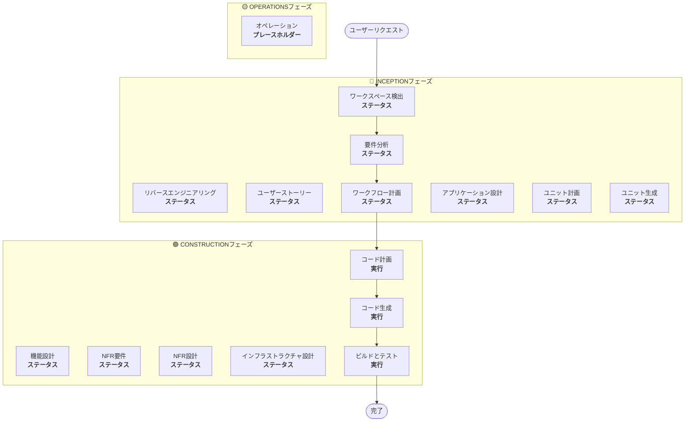

# ワークフロー計画

**目的**: 実行するフェーズを決定し、包括的な実行計画を作成します。

**常時実行**: このフェーズは、要件とスコープを理解した後に常に実行されます。

## ステップ1: すべての事前コンテキストの読み込み

### 1.1 リバースエンジニアリング成果物の読み込み（ブラウンフィールドの場合）
- architecture.md
- component-inventory.md
- technology-stack.md
- dependencies.md

### 1.2 要件分析の読み込み
- requirements.md（意図分析を含む）
- requirement-verification-questions.md（回答付き）

### 1.3 ユーザーストーリーの読み込み（実行された場合）
- stories.md
- personas.md

## ステップ2: 詳細なスコープと影響分析

**完全なコンテキスト（要件＋ストーリー）が得られたので、詳細な分析を実行します：**

### 2.1 変換スコープの検出（ブラウンフィールドのみ）

**ブラウンフィールドプロジェクトの場合**、変換スコープを分析します：

#### アーキテクチャ変換
- **単一コンポーネントの変更** vs **アーキテクチャ変換**
- **インフラストラクチャの変更** vs **アプリケーションの変更**
- **デプロイメントモデルの変更**（Lambda→コンテナ、EC2→サーバーレスなど）

#### 関連コンポーネントの特定
変換のために、以下を特定します：
- 更新が必要な**インフラストラクチャコード**
- 変更が必要な**CDKスタック**
- **API Gateway** の設定
- **ロードバランサー**の要件
- 必要な**ネットワーキング**の変更
- **監視/ロギング**の適応

#### パッケージ横断的な影響
- 更新が必要な**CDKインフラストラクチャ**パッケージ
- バージョン更新が必要な**共有モデル**
- エンドポイント変更が必要な**クライアントライブラリ**
- 新しいテストシナリオが必要な**テストパッケージ**

### 2.2 変更影響評価

#### 影響領域
1. **ユーザー向けの変更**: これはユーザーエクスペリエンスに影響しますか？
2. **構造的な変更**: これはシステムアーキテクチャを変更しますか？
3. **データモデルの変更**: これはデータベーススキーマやデータ構造に影響しますか？
4. **APIの変更**: これはインターフェースや契約に影響しますか？
5. **NFRへの影響**: これはパフォーマンス、セキュリティ、またはスケーラビリティに影響しますか？

#### アプリケーション層への影響（該当する場合）
- **コード変更**: 新しいエントリーポイント、アダプター、設定
- **依存関係**: 新しいライブラリ、フレームワークの変更
- **設定**: 環境変数、設定ファイル
- **テスト**: ユニットテスト、統合テスト

#### インフラストラクチャ層への影響（該当する場合）
- **デプロイメントモデル**: Lambda→ECS、EC2→Fargateなど
- **ネットワーキング**: VPC、セキュリティグループ、ロードバランサー
- **ストレージ**: 永続ボリューム、共有ストレージ
- **スケーリング**: 自動スケーリングポリシー、キャパシティプランニング

#### 運用層への影響（該当する場合）
- **監視**: CloudWatch、カスタムメトリクス、ダッシュボード
- **ロギング**: ログ集約、構造化ロギング
- **アラート**: アラーム設定、通知チャネル
- **デプロイメント**: CI/CDパイプラインの変更、ロールバック戦略

### 2.3 コンポーネント関係マッピング（ブラウンフィールドのみ）

**ブラウンフィールドプロジェクトの場合**、コンポーネント依存グラフを作成します：

```markdown
## コンポーネント関係
- **主要コンポーネント**: [変更されるパッケージ]
- **インフラストラクチャコンポーネント**: [CDK/Terraformパッケージ]
- **共有コンポーネント**: [モデル、ユーティリティ、クライアント]
- **依存コンポーネント**: [このコンポーネントを呼び出すサービス]
- **サポートコンポーネント**: [監視、ロギング、デプロイメント]
```

各関連コンポーネントについて：
- **変更タイプ**: メジャー、マイナー、設定のみ
- **変更理由**: 直接依存、デプロイメントモデル、ネットワーキング
- **変更優先度**: クリティカル、重要、任意

### 2.4 リスク評価

リスクレベルを評価します：
1. **低**: 隔離された変更、簡単なロールバック、よく理解されている
2. **中**: 複数のコンポーネント、中程度のロールバック、いくつかの未知数
3. **高**: システム全体への影響、複雑なロールバック、重大な未知数
4. **クリティカル**: 本番環境で重要、困難なロールバック、高い不確実性

## ステップ3: フェーズ決定

### 3.1 ユーザーストーリー - 実行済みかスキップか？
**実行済み**: 次の決定へ
**未実行 - 実行条件**:
- 複数のユーザーペルソナ
- ユーザーエクスペリエンスへの影響
- 受け入れ基準が必要
- チームの協力が必要

**スキップ条件**:
- 内部リファクタリング
- 明確な再現手順があるバグ修正
- 技術的負債の削減
- インフラストラクチャの変更

### 3.2 アプリケーション設計 - 実行条件:
- 新しいコンポーネントやサービスが必要
- コンポーネントのメソッドとビジネスルールの定義が必要
- サービスレイヤーの設計が必要
- コンポーネントの依存関係の明確化が必要

**スキップ条件**:
- 既存のコンポーネント境界内での変更
- 新しいコンポーネントやメソッドがない
- 純粋な実装の変更

### 3.3 設計（ユニット計画/生成） - 実行条件:
- 新しいデータモデルやスキーマ
- APIの変更または新しいエンドポイント
- 複雑なアルゴリズムやビジネスロジック
- 状態管理の変更
- 複数のパッケージで変更が必要
- Infrastructure-as-Codeの更新が必要

**スキップ条件**:
- 単純なロジックの変更
- UIのみの変更
- 設定の更新
- 単純な実装

### 3.4 NFR実装 - 実行条件:
- パフォーマンス要件
- セキュリティの考慮事項
- スケーラビリティの懸念
- 監視/オブザーバビリティが必要

**スキップ条件**:
- 既存のNFR設定で十分
- 新しいNFR要件がない
- NFRへの影響がない単純な変更

## ステップ4: 適応的な詳細度の注記

**適応的な詳細度の説明については `[depth-levels.md](../common/depth-levels.md)` を参照してください**

実行される各ステージについて：
- 定義されたすべての成果物が作成されます
- 成果物内の詳細レベルは問題の複雑さに適応します
- モデルは問題の特性に基づいて適切な詳細度を決定します

## ステップ5: マルチモジュール調整分析（ブラウンフィールドのみ）

**複数のモジュール/パッケージを持つブラウンフィールドの場合**、依存関係を分析し、最適な更新戦略を決定します：

### 5.1 モジュール依存関係の分析
- ビルドシステムの依存関係と依存マニフェストを調査します
- ビルド時と実行時の依存関係を特定します
- モジュール間のAPI契約と共有インターフェースをマッピングします

### 5.2 更新戦略の決定
依存関係分析に基づき、以下を決定します：
- **更新順序**: 依存関係のために最初に更新する必要があるモジュール
- **並列化の機会**: 同時に更新できるモジュール
- **調整要件**: バージョンの互換性、API契約、デプロイ順序
- **テスト戦略**: モジュールごと vs 統合テストアプローチ
- **ロールバック戦略**: シーケンス途中で障害が発生した場合の回復計画

### 5.3 調整計画の文書化
```markdown
## モジュール更新戦略
- **更新アプローチ**: [シーケンシャル/パラレル/ハイブリッド]
- **クリティカルパス**: [他の更新をブロックするモジュール]
- **調整ポイント**: [共有API、インフラストラクチャ、データ契約]
- **テストチェックポイント**: [統合を検証するタイミング]
```

影響を受ける各モジュールについて特定します：
- **更新優先度**: 最初に更新必須 vs 後で更新可能
- **依存関係の制約**: 何に依存しているか、何がそれに依存しているか
- **変更範囲**: メジャー（破壊的）、マイナー（互換性あり）、パッチ（修正）

## ステップ6: ワークフローの視覚化の生成

以下を示すMermaidフローチャートを作成します：
- すべてのフェーズを順に表示
- 各条件付きフェーズの実行またはスキップの決定
- 各フェーズの状態に応じた適切なスタイリング

**スタイリングルール**（フローチャートの後に追加）：
```
style WD fill:#4CAF50,stroke:#1B5E20,stroke-width:3px,color:#fff
style CP fill:#4CAF50,stroke:#1B5E20,stroke-width:3px,color:#fff
style CG fill:#4CAF50,stroke:#1B5E20,stroke-width:3px,color:#fff
style BT fill:#4CAF50,stroke:#1B5E20,stroke-width:3px,color:#fff
style US fill:#BDBDBD,stroke:#424242,stroke-width:2px,stroke-dasharray: 5 5,color:#000
style Start fill:#CE93D8,stroke:#6A1B9A,stroke-width:3px,color:#000
style End fill:#CE93D8,stroke:#6A1B9A,stroke-width:3px,color:#000

linkStyle default stroke:#333,stroke-width:2px
```

**スタイルガイドライン**:
- 完了/常時実行: `fill:#4CAF50,stroke:#1B5E20,stroke-width:3px,color:#fff` (マテリアルグリーン、白文字)
- 条件付き実行: `fill:#FFA726,stroke:#E65100,stroke-width:3px,stroke-dasharray: 5 5,color:#000` (マテリアルオレンジ、黒文字)
- 条件付きスキップ: `fill:#BDBDBD,stroke:#424242,stroke-width:2px,stroke-dasharray: 5 5,color:#000` (マテリアルグレー、黒文字)
- 開始/終了: `fill:#CE93D8,stroke:#6A1B9A,stroke-width:3px,color:#000` (マテリアルパープル、黒文字)
- フェーズコンテナ: 明るいマテリアルカラーを使用 (INCEPTION: #BBDEFB, CONSTRUCTION: #C8E6C9, OPERATIONS: #FFF59D)

## ステップ7: 実行計画ドキュメントの作成

`aidlc-docs/inception/plans/execution-plan.md` を作成します：

```markdown
# 実行計画

## 詳細分析サマリー

### 変換スコープ（ブラウンフィールドのみ）
- **変換タイプ**: [単一コンポーネント/アーキテクチャ/インフラストラクチャ]
- **主な変更**: [説明]
- **関連コンポーネント**: [リスト]

### 変更影響評価
- **ユーザー向けの変更**: [はい/いいえ - 説明]
- **構造的な変更**: [はい/いいえ - 説明]
- **データモデルの変更**: [はい/いいえ - 説明]
- **APIの変更**: [はい/いいえ - 説明]
- **NFRへの影響**: [はい/いいえ - 説明]

### コンポーネント関係（ブラウンフィールドのみ）
[コンポーネント依存グラフ]

### リスク評価
- **リスクレベル**: [低/中/高/クリティカル]
- **ロールバックの複雑さ**: [容易/中程度/困難]
- **テストの複雑さ**: [単純/中程度/複雑]

## ワークフローの視覚化



**注意**: ステータスのプレースホルダーを実際のフェーズの状態（COMPLETED/SKIP/EXECUTE）に置き換え、適切なスタイリングを適用してください。

## 実行するフェーズ

### 🔵 INCEPTIONフェーズ
- [x] ワークスペース検出 (完了)
- [x] リバースエンジニアリング (完了/スキップ)
- [x] 要件詳細化 (完了)
- [x] ユーザーストーリー (完了/スキップ)
- [x] 実行計画 (進行中)
- [ ] アプリケーション設計 - [実行/スキップ]
  - **根拠**: [実行またはスキップする理由]
- [ ] ユニット計画 - [実行/スキップ]
  - **根拠**: [実行またはスキップする理由]
- [ ] ユニット生成 - [実行/スキップ]
  - **根拠**: [実行またはスキップする理由]

### 🟢 CONSTRUCTIONフェーズ
- [ ] 機能設計 - [実行/スキップ]
  - **根拠**: [実行またはスキップする理由]
- [ ] NFR要件 - [実行/スキップ]
  - **根拠**: [実行またはスキップする理由]
- [ ] NFR設計 - [実行/スキップ]
  - **根拠**: [実行またはスキップする理由]
- [ ] インフラストラクチャ設計 - [実行/スキップ]
  - **根拠**: [実行またはスキップする理由]
- [ ] コード計画 - 実行 (常時)
  - **根拠**: 実装アプローチが必要
- [ ] コード生成 - 実行 (常時)
  - **根拠**: コード実装が必要
- [ ] ビルドとテスト - 実行 (常時)
  - **根拠**: ビルド、テスト、検証が必要

### 🟡 OPERATIONSフェーズ
- [ ] オペレーション - プレースホルダー
  - **根拠**: 将来のデプロイメントと監視ワークフロー

## パッケージ変更シーケンス（ブラウンフィールドのみ）
[該当する場合、依存関係とともにパッケージ更新シーケンスをリストアップ]

## 推定タイムライン
- **合計フェーズ数**: [数]
- **推定期間**: [時間見積もり]

## 成功基準
- **主要目標**: [主目的]
- **主要成果物**: [リスト]
- **品質ゲート**: [リスト]

[ブラウンフィールドの場合]
- **統合テスト**: すべてのコンポーネントが連携して動作する
- **運用準備**: 監視、ロギング、アラートが動作する
```

## ステップ8: 状態追跡の初期化

`aidlc-docs/aidlc-state.md` を更新します：

```markdown
# AI-DLC 状態追跡

## プロジェクト情報
- **プロジェクトタイプ**: [グリーンフィールド/ブラウンフィールド]
- **開始日**: [ISOタイムスタンプ]
- **現在のステージ**: INCEPTION - ワークフロー計画

## 実行計画サマリー
- **合計ステージ数**: [数]
- **実行するステージ**: [リスト]
- **スキップするステージ**: [理由付きリスト]

## ステージの進捗

### 🔵 INCEPTIONフェーズ
- [x] ワークスペース検出
- [x] リバースエンジニアリング（該当する場合）
- [x] 要件分析
- [x] ユーザーストーリー（該当する場合）
- [x] ワークフロー計画
- [ ] アプリケーション設計 - [実行/スキップ]
- [ ] ユニット計画 - [実行/スキップ]
- [ ] ユニット生成 - [実行/スキップ]

### 🟢 CONSTRUCTIONフェーズ
- [ ] 機能設計 - [実行/スキップ]
- [ ] NFR要件 - [実行/スキップ]
- [ ] NFR設計 - [実行/スキップ]
- [ ] インフラストラクチャ設計 - [実行/スキップ]
- [ ] コード計画 - 実行
- [ ] コード生成 - 実行
- [ ] ビルドとテスト - 実行

### 🟡 OPERATIONSフェーズ
- [ ] オペレーション - プレースホルダー

## 現在の状態
- **ライフサイクルフェーズ**: INCEPTION
- **現在のステージ**: ワークフロー計画完了
- **次のステージ**: [次に実行するステージ]
- **ステータス**: 進行準備完了
```

## ステップ9: ユーザーへの計画提示

```markdown
# 📋 ワークフロー計画完了

以下に基づいて包括的な実行計画を作成しました：
- あなたのリクエスト: [サマリー]
- 既存システム: [ブラウンフィールドの場合のサマリー]
- 要件: [実行された場合のサマリー]
- ユーザーストーリー: [実行された場合のサマリー]

**詳細分析**:
- リスクレベル: [レベル]
- 影響: [主な影響のサマリー]
- 影響を受けるコンポーネント: [リスト]

**推奨実行計画**:

[X]個のステージを実行することを推奨します：

🔵 **INCEPTIONフェーズ:**
1. [ステージ名] - *根拠:* [実行する理由]
2. [ステージ名] - *根拠:* [実行する理由]
...

🟢 **CONSTRUCTIONフェーズ:**
3. [ステージ名] - *根拠:* [実行する理由]
4. [ステージ名] - *根拠:* [実行する理由]
...

[Y]個のステージをスキップすることを推奨します：

🔵 **INCEPTIONフェーズ:**
1. [ステージ名] - *根拠:* [スキップする理由]
2. [ステージ名] - *根拠:* [スキップする理由]
...

🟢 **CONSTRUCTIONフェーズ:**
3. [ステージ名] - *根拠:* [スキップする理由]
4. [ステージ名] - *根拠:* [スキップする理由]
...

[複数のパッケージを持つブラウンフィールドの場合]
**推奨パッケージ更新シーケンス**:
1. [パッケージ] - [理由]
2. [パッケージ] - [理由]
...

**推定タイムライン**: [期間]

> **📋 <u>**レビューが必要です:**</u>**  
> `aidlc-docs/inception/plans/execution-plan.md` で実行計画を確認してください。

> **🚀 <u>**次のステップ:**</u>**
>
> **以下のアクションが可能です：**
>
> 🔧 **変更をリクエスト** - 必要に応じて実行計画の修正を依頼します
> [スキップされたステージがある場合:]
> 📝 **スキップされたステージを追加** - 現在スキップとマークされているステージを含めることを選択します
> ✅ **承認して続行** - 計画を承認し、**[次のステージ名]**に進みます
```

## ステップ10: ユーザーの応答を処理

- **承認された場合**: 実行計画の次のステージに進みます
- **変更が要求された場合**: 実行計画を更新し、再確認します
- **ユーザーがステージの強制的な包含/除外を希望する場合**: それに応じて計画を更新します

## ステップ11: 対話の記録

`aidlc-docs/audit.md` に記録します：

```markdown
## ワークフロー計画 - 承認
**タイムスタンプ**: [ISOタイムスタンプ]
**AIプロンプト**: "この計画で進行してよろしいですか？"
**ユーザーの応答**: "[ユーザーの完全な生の応答]"
**ステータス**: [承認済み/変更要求あり]
**コンテキスト**: [X]個の実行ステージを持つワークフロー計画が作成されました

---
```