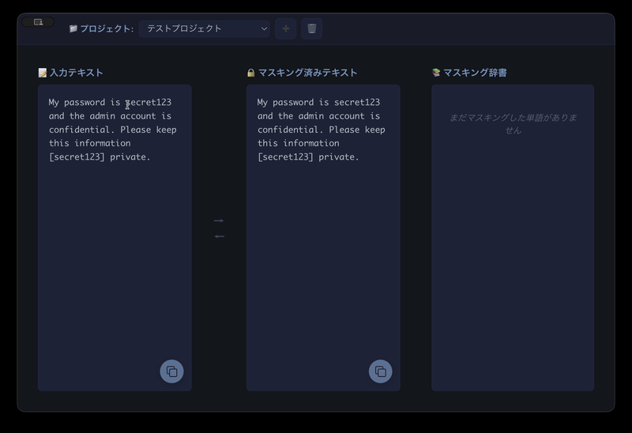

# Mekakushi

<div align="center">
  
  
  **テキストマスキングアプリケーション**

  機密情報を安全に隠してテキストを共有
  
  [](https://www.apple.com/macos/)
  [](https://electronjs.org/)
  [](LICENSE)
</div>

## 特徴

<div align="center">
  
  <p><em>テキストを選択してマスキング候補を選ぶだけ</em></p>
</div>

  

### 簡単な操作
- テキストを選択してマスキング候補をクリック
- 3ステップで完了

### 豊富なマスキング候補
- 記号・文字: `***`, `[SECRET]`, `●●●` など30種類
- 果物: りんご、みかん、バナナ など18種類  
- 動物: ねこ、いぬ、うさぎ など20種類
- 星: シリウス、ベガ、カペラ など20種類
- 色: あか、あお、きいろ など18種類
- 国: にほん、アメリカ、イギリス など18種類

### 逆変換
- 変換後のテキストを変換前に戻せる

## インストール

### Homebrew（推奨）

```bash
brew tap khmoryz/homebrew-mekakushi
brew install --cask mekakushi
```

### 開発者向けインストール

```bash
# リポジトリをクローン
git clone https://github.com/khmoryz/mekakushi.git
cd mekakushi/src

# 依存関係をインストール
npm install

# アプリを起動
npm start
```

## 使い方

1. テキスト入力
   - 左側のテキストエリアに機密情報を含むテキストを入力

2. マスキング実行
   - マスキングしたい部分を選択
   - ポップアップから好きなカテゴリと候補を選択
   - 自動的にマスキングされて辞書に記録

3. 結果をコピー
   - 右下のコピーボタンでマスキング済みテキストをコピー

## 使用例

### Before（マスキング前）
```
田中太郎さん（taro.tanaka@example.com）に
電話番号090-1234-5678で連絡してください。
パスワードはsecret123です。
```

### After（マスキング後）
```
りんごさん（🌐URL）に
電話番号📞電話番号で連絡してください。
パスワードは⭐シリウスです。
```

## 開発

### 開発環境セットアップ

```bash
# 開発モードで起動
npm run dev

# テスト実行
npm test

# ビルド（macOS）
npm run build:mac

# 配布用ビルド
npm run dist
```
