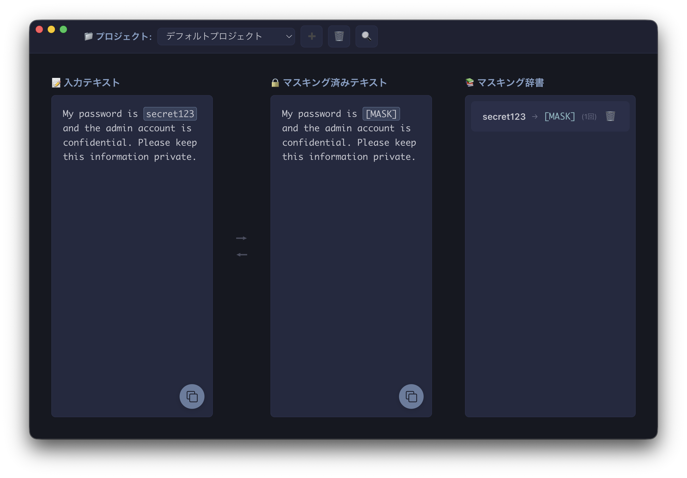

# Mekakushi

<div align="center">
  
  
  **テキストマスキングアプリケーション**
  
  機密情報を安全に隠してテキストを共有
  
  [](https://www.apple.com/macos/)
  [](https://electronjs.org/)
  [](LICENSE)
</div>

## 特徴

### 簡単な操作
- テキストを選択してマスキング候補をクリック
- 3ステップで完了

### 豊富なマスキング候補
- 記号・文字: `***`, `[SECRET]`, `●●●` など30種類
- 果物: りんご、みかん、バナナ など18種類  
- 動物: ねこ、いぬ、うさぎ など20種類
- 星: シリウス、ベガ、カペラ など20種類
- 色: あか、あお、きいろ など18種類
- 国: にほん、アメリカ、イギリス など18種類

### リアルタイム同期
- 入力と同時に出力テキストに反映
- 過去のマスキング履歴を自動適用
- ハイライト表示で変換箇所を視覚化

### その他の機能
- ワンクリックコピー
- 辞書の個別削除
- プロジェクト管理
- 使用履歴の記録

## スクリーンショット

<div align="center">
  
  <p><em>テキストを選択してマスキング候補を選ぶだけ</em></p>
</div>

## インストール

### Homebrew（推奨）

```bash
brew tap khmoryz/homebrew-mekakushi
brew install --cask mekakushi
```

メリット:
- Gatekeeperの警告を自動回避
- ワンコマンドでインストール完了
- アップデートも簡単（`brew upgrade mekakushi`）

### 手動インストール

1. [Releases ページ](https://github.com/khmoryz/mekakushi/releases)にアクセス
2. 最新の `Mekakushi-darwin-arm64-x.x.x.zip` をダウンロード
3. zipファイルを解凍
4. Mekakushi.appをアプリケーションフォルダに移動
5. 初回起動時の注意: Gatekeeperの警告が出る場合は以下を実行
   ```bash
   xattr -cr /Applications/Mekakushi.app
   ```
   または、右クリック→「開く」で起動

### 開発者向けインストール

```bash
# リポジトリをクローン
git clone https://github.com/khmoryz/mekakushi.git
cd mekakushi/src

# 依存関係をインストール
npm install

# アプリを起動
npm start
```

## 使い方

1. テキスト入力
   - 左側のテキストエリアに機密情報を含むテキストを入力

2. マスキング実行
   - マスキングしたい部分を選択
   - ポップアップから好きなカテゴリと候補を選択
   - 自動的にマスキングされて辞書に記録

3. 結果をコピー
   - 右下のコピーボタンでマスキング済みテキストをコピー

## 使用例

### Before（マスキング前）
```
田中太郎さん（taro.tanaka@example.com）に
電話番号090-1234-5678で連絡してください。
パスワードはsecret123です。
```

### After（マスキング後）
```
りんごさん（🌐URL）に
電話番号📞電話番号で連絡してください。
パスワードは⭐シリウスです。
```

## 開発

### 技術スタック

- Electron 39.2.7
- JavaScript (ES6+)
- HTML5 + CSS3
- Playwright (テスト)
- electron-builder (ビルド)

### 開発環境セットアップ

```bash
# 開発モードで起動
npm run dev

# テスト実行
npm test

# ビルド（macOS）
npm run build:mac

# 配布用ビルド
npm run dist
```

### リリース手順

1. バージョンアップ
```bash
npm version patch  # または minor, major
```

2. タグをプッシュ
```bash
git push origin --tags
```

3. 自動ビルド・リリース
- GitHub Actionsが自動的にZIPをビルド
- GitHub Releasesに自動アップロード
- リリースノートも自動生成

### プロジェクト構造

```
src/
├── main.js          # Electronメインプロセス
├── preload.js       # プリロードスクリプト
├── index.html       # メインUI
├── js/
│   ├── managers/    # 機能管理クラス
│   ├── models/      # データモデル
│   └── utils/       # ユーティリティ
├── assets/
│   └── icon.png     # アプリアイコン
└── tests/           # テストファイル
```

## コントリビューション

プルリクエストやイシューの報告を歓迎します。

1. このリポジトリをフォーク
2. フィーチャーブランチを作成 (`git checkout -b feature/amazing-feature`)
3. 変更をコミット (`git commit -m 'feat: 素晴らしい機能を追加'`)
4. ブランチにプッシュ (`git push origin feature/amazing-feature`)
5. プルリクエストを作成

### コミットメッセージ規約

```
feat(scope): 新機能を追加
fix(scope): バグを修正
docs: ドキュメントを更新
style: コードスタイルを修正
refactor: リファクタリング
test: テストを追加
chore: その他の変更
```

## ライセンス

このプロジェクトは [MIT License](LICENSE) の下で公開されています。
